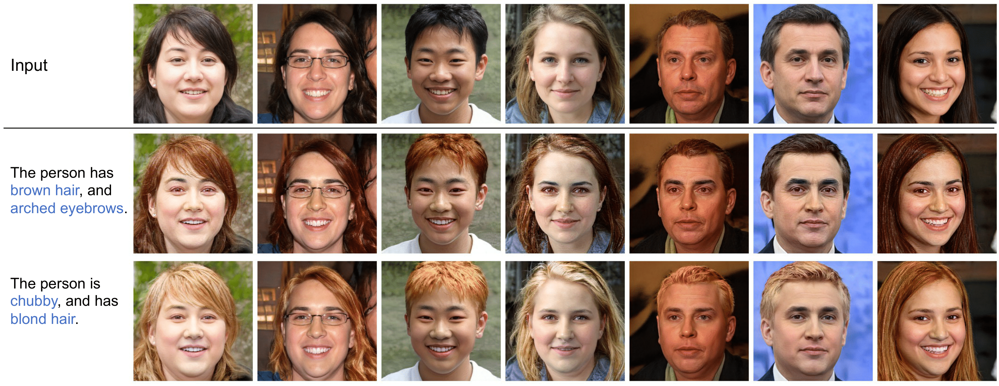

# ManiCLIP

## Official PyTorch implementation



**ManiCLIP: Multi-Attribute Face Manipulation from Text**   
Hao Wang, Guosheng Lin, Ana García del Molino, Anran Wang, Jiashi Feng, Zhiqi Shen   
[**Paper**](https://arxiv.org/abs/2210.00445)

Abstract: *In this paper we present a novel multi-attribute face manipulation method based on textual descriptions. Previous text-based image editing methods either require test-time optimization for each individual image or are restricted to single attribute editing. Extending these methods to multi-attribute face image editing scenarios will introduce undesired excessive attribute change, e.g., text-relevant attributes are overly manipulated and text-irrelevant attributes are also changed. In order to address these challenges and achieve natural editing over multiple face attributes, we propose a new decoupling training scheme where we use group sampling to get text segments from same attribute categories, instead of whole complex sentences. Further, to preserve other existing face attributes, we encourage the model to edit the latent code of each attribute separately via an entropy constraint. During the inference phase, our model is able to edit new face images without any test-time optimization, even from complex textual prompts. We show extensive experiments and analysis to demonstrate the efficacy of our method, which generates natural manipulated faces with minimal text-irrelevant attribute editing.*

## Dataset

During the training phase, we do not need any data, except the 40-category face [attributes](https://mmlab.ie.cuhk.edu.hk/projects/CelebA.html) (list_attr_celeba.txt). During the testing phase, the text data can be obtained from [Multi-Modal-CelebA-HQ](https://github.com/IIGROUP/MM-CelebA-HQ-Dataset) (text.zip).

## Pretrained models

The pretrained models can be downloaded from this [link](https://entuedu-my.sharepoint.com/:u:/g/personal/hao005_e_ntu_edu_sg/EVJ4RLcEpgNLoHSZ6zAuCxMB1MWFrLz0CSGwKU-T9Bu3tA?e=uzHiZw).

## Training

You can train new face editing networks using `train.py`.

```.bash
python train.py --epochs 30 --loss_id_weight 0.05 --loss_w_norm_weight 0.1 --loss_clip_weight 1.0 --loss_face_norm_weight 0.05 --loss_minmaxentropy_weight 0.2 --loss_face_bg_weight 1 --task_name name --decouple --part_sample_num 3
```

## Generation

To generate edited images based on language:

```.bash
python generate.py --model_path pretrained/pretrained_edit_model.pth.tar --text "this person has grey hair. he has mustache." --gen_num 5
```

## Reference
If you find this repository useful, please cite:
```
@article{wang2022maniclip,
  title={ManiCLIP: Multi-Attribute Face Manipulation from Text},
  author={Wang, Hao and Lin, Guosheng and del Molino, Ana Garc{\'\i}a and Wang, Anran and Feng, Jiashi and Shen, Zhiqi},
  journal={arXiv preprint arXiv:2210.00445},
  year={2022}
}
```
